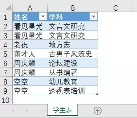
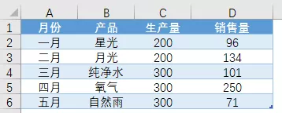
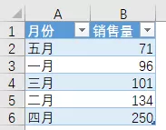
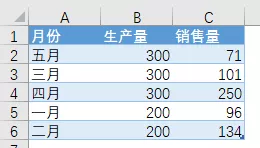
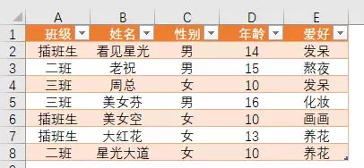
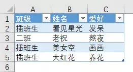
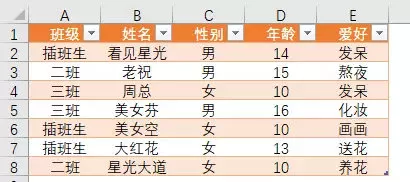
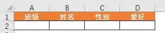
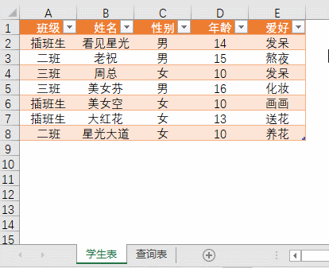

## Excel VBA+ADO+SQL入门教程002：简单认识ADO

本文记录一下EXCEL VBA+ADO+SQL入门教程，不知道有没有用，学习一下先：

教程来源：https://mp.weixin.qq.com/s/O-clp1rAqU338ZlQPngftg

**对VBA无感或无基础者，本章可跳过，并不影响之后的SQL学习。**


示例文件下载

链接: https://pan.baidu.com/s/10Czj_9LtAKIVN5YatIdnAQ

提取码: sesv

## 1.

ADO (ActiveX Data Objects，ActiveX数据对象）是微软提出的应用程序接口，用以实现访问关系或非关系数据库中的数据……更多概念信息请自行咨询百度君，无赖脸。

之所以要学习ADO，一个原因是ADO自身的一些属性和方法对于数据处理是极其有益的；而首要原因是，在EXCEL VBA中，一般只有通过ADO，才可以使用强大的SQL查询语言访问外部数据源，进而查、改、增、删外部数据源中的数据。

后面这话延伸在具体编程操作上，就形成了四步走发展战略……

**1.VBA引用ADO类库。**

**2.ADO建立对数据源的链接。**

**3.ADO执行SQL语言。**

**4.VBA处理\**SQL查询结果。\****

嗯，这就好比你先找个女（男）朋友，然后谈恋爱，最后才能结婚……

**
**

## 2.

在VBA中引用ADO类库一般有两种方式。

一种是前期绑定。

所谓前期绑定，是指在VBE中手工勾选引用Microsoft ADO相关类库。

在Excel中，按<Alt+F11>快捷键打开VBA编辑窗口，依次单击【工具】→【引用】，打开【引用-VBAProject】对话框。在【可使用的引用】列表框中，勾选“Microsoft ActiveX Data Objects 2.8 Library”库，**或**“Microsoft ActiveX Data Objects 6.1 Library”库，单击【确定】按钮关闭对话框。

      

另一种是使用代码后期绑定。

```vbscript
Sub 后期绑定()    Dim cnn As Object    
    Set cnn = CreateObject("adodb.connection")
End Sub
```

两种方式的主要区别是，前期绑定后，在代码编辑过程中，VBE的“自动列出成员”功能，可以提供ADO的属性和方法，这便于代码快捷、准确的编写，但当他人的Excel工作簿并没有手工前期绑定ADO类库时，相关代码将无法运行；因此后期代码绑定ADO的通用性会更强些，它不需要手工绑定相关类库。

星光俺老油……老江湖的经验是，代码编写及调试时，使用前期绑定，代码完善后，再修改为后期绑定发布使用。

## 3.

不论我们使用SQL语言对数据源作何操作，都得首先使用ADO创建并打开一个由VBA到数据源的链接；这就好比得先修路，才能使用汽车运输货物。

在VBA中，我们通常使用ADO的Connection.Open语句来显式建立一个到数据源的链接。

Connection.Open语法如下：

connection.Open ConnectionString, UserID, Password, Options

**ConnectionString可选，字符串，包含连接信息。**

UserID可选，字符串，包含建立连接时所使用用户名。

Password可选，字符串，包含建立连接时所使用密码。

Options可选，决定该方法是在连接建立之后（异步）还是连接建立之前（同步）返回，默认是同步，adAsyncConnect是异步。

……**语法看起来似乎很复杂？****不必烦扰，现在，对我们而言，重点只是****大体了解一下****参数ConnectionString，也就是连接字符串****。**虽然不同的数据库或文件有不同的连接字符串，但常用的数据库或文件的连接字符串均是固定的。

举个例子，如果将代码所在的Excel（2016版）作为一个外部数据源建立链接，代码如下：

```vbscript
Sub Mycnn()    
    Dim cnn As Object    '定义变量    
    Set cnn = CreateObject("adodb.connection")    '后期绑定ADO    
    cnn.Open "Provider=Microsoft.ACE.OLEDB.12.0;Extended Properties='Excel 12.0;HDR=yes;IMEX=0';Data Source=" & ThisWorkbook.FullName    '建立链接    
    cnn.Close    '关闭链接    
    Set cnn = Nothing    '释放内存
End Sub
```

说一下上面代码连接字符串中各关键字（字体加粗部分）的意思。

**Provider**是Connection 对象提供者名称的字符串值，03版Excel是“Microsoft.jet.OLEDB.4.0”，其它版本可以使用“Microsoft.ACE.OLEDB.12.0”；

**Extended Properties**是Excel版本号及其它相关信息，03版本是Excel 8.0，其它版本可以使用Excel 12.0。

其中**HDR项**是引用工作表是否有标题行，默认值HDR=Yes，意思是引用表的第一行是标题行，标题只能一行，不能多行，亦不能存在合并单元格。HDR=no，意思是引用表不存在标题行，也就是说第一行开始就是数据记录了；此时，相关字段名在SQL语句中可以使用f加序列号表示，第1列字段名是f1，第2列字段名是f2，其余以此类推，f是英文field(字段)的缩写。

**IMEX项**是汇入模式，默认为0（只读模式），1是只写，2是可读写。当参数设置为1时，除了只写，还有默认全部记录数据类型为文本的用途，关于这一点及其限制前提我们以后再谈。

**Data Source**是数据来源工作薄的完整路径。

VBA代码Application.Version可以获取计算机的Excel版本号，因此以下代码兼顾了03及各高级版本Excel的情况

```vbscript
Sub Mycnn3()    
    Dim cnn As Object    
    Dim strPath As String    
    Dim str_cnn As String    
    Set cnn = CreateObject("adodb.connection")    
    strPath = ThisWorkbook.FullName    
    If Application.Version < 12 Then        
        str_cnn = "Provider=Microsoft.jet.OLEDB.4.0;Extended Properties=Excel 8.0;Data Source=" & strPath    
    Else        
        str_cnn = "Provider=Microsoft.ACE.OLEDB.12.0;Extended Properties=Excel 12.0;Data Source=" & strPath    
    End If    
    cnn.Open str_cnn    
    cnn.Close    
    Set cnn = Nothing
End sub
```

最后，需要提醒大家的是，链接是一种昂贵的资源（官方语），因此在代码运行完毕后，请养成关闭链接（cnn.Close）并释放内存（Set cnn = Nothing）的好习惯。

 **本节小贴士：**

3.1，连接字符串中各关键字的对应值可能和大小写有关，这是因为不同数据库的要求可能不一样，但通常来说，关键字和大小写无关，例如Provider，可以写成provider或者PROVIDER。不过，虽然关键字和大小写无关，但和拼写正确与否……当然是有关的！（想啥呢哥们？）当手打的连接字符串代码运行出错时，建议先复制正确的运行，再仔细核对个人错漏之处。

3.2，连接字符串中各关键字之间使用英文分号（;）间隔，例如（关键字1=值1;关键字2=值2;关键字3=值3……），另外，任何包含分号、单引号或双引号的值必须用双引号引起来，由于在VBA中连接字符串的外层已经存在了一个双引号，因此通常使用英文单引号进行转义，例如上例中的Extended Properties=**'**Excel 12.0;HDR=yes;IMEX=2**'**，抄写时，千万别漏了英文单引号哦。

3.3，星光俺掐指一算，算出相当一部分童鞋英语水平堪忧，想来拼写这段英文连接字符串错漏百出是很有可能的，因此特呈上锦囊一份，参见下图。别问我这图是哪来的，如果不几道，佛山无银脚，出门右拐重看第一章吧~

如果这锦囊您也不想用——其实收藏本帖，用到时打开帖子复制粘贴相关代码就可以了——嘿嘿，木错，这才是最常用的一招。

      

## 4.

聊完了如何绑定ADO以及建立与数据源的链接……

最后说下如何使用ADO执行SQL语句。

我们可以使用ADO的Connection对象或Recordset、Commannd执行SQL语句；详细内容我们放到ADO部分再讲；这里大家只需要先了解Connection对象的Execute方法就可以了。

这是一个最常用的VBA+ADO+SQL套路化查询代码，通常，我们只需要修改SQL语言以及放置查询结果的单元格位置。

```vbscript
Sub DoSql_Execute1()    
    Dim cnn As Object, rst As Object    
    Dim strPath As String, str_cnn As String, strSQL As String    
    Dim i As Long    
    Set cnn = CreateObject("adodb.connection")    
    '以上是第一步，后期绑定ADO    
    '    
    strPath = ThisWorkbook.FullName    
    If Application.Version < 12 Then        
        str_cnn = "Provider=Microsoft.jet.OLEDB.4.0;Extended Properties=Excel 8.0;Data Source=" & strPath    
    Else        
        str_cnn = "Provider=Microsoft.ACE.OLEDB.12.0;Extended Properties=Excel 12.0;Data Source=" & strPath    
    End If    
    cnn.Open str_cnn    
    '以上是第二步，建立链接    
    '    
    strSQL = "SELECT 姓名,成绩 FROM [Sheet1$] WHERE 成绩>=80"    
    'SQL语句，查询Sheet1表成绩大于80……姓名和成绩的记录    
    Set rst = cnn.Execute(strSQL)    
    'cnn.Execute()执行SQL语句，始终得到一个新的记录集rst    
    '以上是第三步，编写并使用SQL语句   
    '    
    [d:e].ClearContents    '清空[d:e]区域的值    
    For i = 0 To rst.Fields.Count - 1    
        '利用fields属性获取所有字段名，fields包含了当前记录有关的所有字段,fields.count得到字段的数量    
        '由于Fields.Count下标为0，又从0开始遍历，因此总数-1        
        Cells(1, i + 4) = rst.Fields(i).Name    
    Next    
    Range("d2").CopyFromRecordset rst    
    '使用单元格对象的CopyFromRecordset方法将rst内容复制到D2单元格为左上角的单元格区域    
    '以上是第四步，将SQL查询结果和字段名写入表格指定区域    
    '    
    cnn.Close    '关闭链接    
    Set cnn = Nothing    '释放内存
End Sub
```

呵，总结一下：

**对于新手而言**，本章的重点是了解VBA执行SQL的操作过程，以及懂得复制**第4节的**代码执行SQL语句，仅此而已，其它？看过就算，大概过一眼，留个印象，以后再见面好说话也就行了。

## 5.

当引用的数据源在其他地方的时候，需要完整的填入文件所在路径，再通过（.）引用具体的工作簿。例如下例是数据源的位置为`D:\EH小学\学生表.xlsx`该文件中的`成绩表`工作簿

```vbscript
Sub ADO_SQL()
    '适用于除2003版以外的高版本Excel
    Dim cnn As Object, rst As Object
    Dim strPath As String, strCnn As String, strSQL As String
    Dim i As Long
    Set cnn = CreateObject("adodb.connection")
    strPath = "D:\EH小学\学生表.xlsx" '指定工作簿
    strCnn = "Provider=Microsoft.ACE.OLEDB.12.0;Extended Properties=Excel 12.0;Data Source=" & strPath
    cnn.Open strCnn '创建并打开到指定工作簿的链接
    strSQL = "SELECT * FROM [成绩表$]" 'strSQL语句，查询成绩表的所有数据
    Set rst = cnn.Execute(strSQL) '执行strSQL
    Cells.ClearContents
    For i = 0 To rst.Fields.Count - 1
        Cells(1, i + 1) = rst.Fields(i).Name
    Next
    Range("a2").CopyFromRecordset rst
    cnn.Close
    Set cnn = Nothing
End Sub
```

但更多的情况是，ADO创建的链接是一个工作簿，需要获取的数据在另一个或多个工作簿，例如跨表格数据查询统计。此时通常使用的代码如下：

```vbscript
Sub ADO_SQL2()
    '适用于除2003版以外的高版本Excel
    Dim cnn As Object, rst As Object
    Dim strPath As String, strCnn As String, strSQL As String
    Dim i As Long
    Set cnn = CreateObject("adodb.connection")
    strPath = ThisWorkbook.FullName '代码所在工作簿的完整名称
    strCnn = "Provider=Microsoft.ACE.OLEDB.12.0;Extended Properties=Excel 12.0;Data Source=" & strPath
    cnn.Open strCnn '创建到代码所在工作簿的链接
    strSQL = "SELECT * FROM [Excel 12.0;DATABASE=D:\EH小学\学生表.xlsm].[成绩表$]"
    Set rst = cnn.Execute(strSQL) '执行SQL
    Cells.ClearContents
    For i = 0 To rst.Fields.Count - 1
        Cells(1, i + 1) = rst.Fields(i).Name
    Next
    Range("a2").CopyFromRecordset rst
    cnn.Close
    Set cnn = Nothing
End Sub
```

## 6. 去重 DISTINCT

在数据分析处理过程中，我们经常需要去除查询结果中的重复值，保留截然不同的唯一值。对于SQL，这类问题，我们通常使用DISTINCT关键字处理。

其语法如下：

**SELECT DISTINCT 字段名 FROM 表名**

举个简单栗子。

      

如上图所示，Excel工作表的表名为“学生表”，A列是姓名，B列是学科，其中A列的姓名存在重复，比如“看见星光”，现在需要使用SQL语句提取不重复的学生名单。

代码如下：

**SELECT DISTINCT 姓名 FROM [学生表$]**

查询结果如下：

      

从查询结果可以看出，重复的人名已被剔除；但数据排列顺序也和数据源不同了。

事实上，系统的操作过程是先对查询结果排序，然后从中剔除重复值。

在Excel中，当查询结果是非中文时，比如数字和字母，DISTINCT处理后的结果明显为升序排列。

当查询结果是中文呢？其实中文也是按升序排列的……只是排序规则不是我们平常所熟知的拼音或笔划顺序。

## 7. 排序用法 `SELECT 字段名 FROM 表名 ORDEY BY 字段名 DESC`

如下图所示，工作表名称为“销售表”，A列是月份，B列是产品，C列是生产量，D列是销售量，数据纯属虚拟，如有雷同——实属雷人。



如果我们需要查询该表月份和销售量两个字段的数据，并将销售量作升序排列，代码如下：

`SELECT 月份,销售量 FROM [销售表$] ORDER BY 销售量`




如果我们需要查询月份、生产量、销售量三个字段的数据，其中**生产量优先排序**，且降序排列，销售量升序排列，代码如下：

```
SELECT 月份,生产量,销售量 FROM [销售表$] ORDER BY 生产量 DESC,销售量 ASC
```

也就是说，ORDER BY语句中，优先排序的字段放在前面，不同字段可以指定不同的排序规则，如果没有指定排序规则，则默认为升序(ASC)排列。代码结果如下：



我们可以用自定义排序规则，也就是使用SQL中的iif或者instr函数。

IF函数类似于工作表的IF函数，语法如下:

```vbscript
=IIF(条件表达式,真值结果,假值结果)
```

使用IIF自定义排序规则的SQL语句如下：

```vbscript
SELECT 月份,销售量 FROM [销售表$] ORDER BY IIF(月份='五月',1,IIF(月份='四月',2,IIF(月份='三月',3,IIF(月份='二月',4,IIF(月份='一月',5)))))
```


代码长的吓人？但意思其实很简单。

……如果月份等于五月，就返回1，否则如果月份等于四月，就返回2，再否则如果月份等于三月……以此类推……最后ORDER BY语句按IIF返回的结果进行升序排序……

再说下INSTR函数。

INSTR函数有些类似于工作表函数FIND，查找一个字符串在另一个字符串中的位置，和FIND不同的是，当找不到相关值时，结果返回0，而非错误值。

```vb
INSTR（str, substr）返回substr在str中的位置，若不存在，则返回0。
```

使用INSTR函数自定义排序规则的SQL语句如下：

```vb
SELECT 月份,销售量 FROM [销售表$] ORDER BY INSTR('五月,四月,三月,二月,一月',月份)
```

INSTR函数的处理语句比起IIF函数来明显要简洁清爽的多。

**——因此我们通常使用该函数处理自定义排序的问题**

## 8.条件筛选，语法：`**SELECT 字段名 FROM 表名 WHERE 筛选条件**`

如下图所示，是一份名为学生表的Excel工作表，A列是班级，B列是姓名，C-E列分别是性别、年龄、爱好。

      

倘若需要查询上述示例中班级为“插班生”的学生名单，SQL代码如下：

`SELECT 班级,姓名 FROM [学生表$] WHERE 班级='插班生'`

班级='插班生'就是where子句的筛选条件，它使用了等号来判断班级字段值和条件值是否相等。需要说明的是，和Excel一样，当条件值是文本时，应该使用半角引号包起来，**而数值则不用**，例如：

`SELECT 班级,姓名 FROM [学生表$] WHERE 年龄>=14`

这个问题我们之前有解释过，这里再说一下。在OLE DB法使用的SQL语句里，单引号和双引号都可以。只是在VBA中，通常SQL语句本身就是作为字符串存在的，外围已经存在了一对双引号，因此SQL语句内一般就使用单引号。

先说一下“与”关系（也就是并且关系）的多条件筛选。

和Excel一样，在SQL中，这类问题通常使用AND运算符。

比如，我们需要查找班级为插班生、同时年龄大于等于12岁的学员名单，SQL代码如下：

`SELECT 班级,姓名,年龄 FROM [学生表$] WHERE 班级='插班生' AND 年龄>=12`

**再说一下“或”关系的多条件筛选，也就是只要符合指定筛选条件中的任一条，结果即OK的where筛选子句。**

在SQL中，这类问题一般使用OR运算符处理。

比如，需要查找班级是插班生**或者**年龄大于等于12岁的学员名单，SQL代码如下：

`SELECT 班级,姓名,年龄 FROM [学生表$] WHERE 班级='插班生'  OR 年龄>=12`

当“或”关系的查询条件较少时，我们使用OR运算符，但当查询条件较多时，OR运算符的书写便变得臃肿烦琐，此时我们可以使用其它运算符，例如BETWEEN和IN。

IN运算符可以指定一个到多个值，每个值之间使用**英文逗号**间隔，最后以括号“()”包括起来。当查询值和括号中的任一值匹配时，则结果即为True。其语法如下：

`Text expression IN (First value,……,last value)`

倘若我们需要查询姓名为：看见星光、老祝、美女空、大红花四个人的班级和爱好数据。

SQL语句如下：

```vb
SELECT 班级,姓名,爱好 FROM [学生表$] WHERE 姓名 IN('看见星光','老祝','美女空','大红花')
```

查询结果如下：

      

between……and语句可以选取介于两个值范围之间的数据，这些值可以是数值、日期和文本（……尽管如此，中文还是别用，原因你懂得）。

例如我们需要查询年龄在13-16岁之间的学员名单。

SQL代码如下：

```vb
SELECT 班级,姓名,年龄 FROM [学生表$] WHERE 年龄 BETWEEN 13 AND 16
```

而反过来，如果我们需要查询年龄**不在**13-16岁之间的学员名单，可以使用NOT运算符搭配between。代码如下：

```vb
SELECT 班级,姓名,年龄 FROM [学生表$] WHERE 年龄 NOT BETWEEN 13 AND 16
```

倘若我们需要获取姓名中包含“光”字的学生名单，SQL代码如下：

```vb
SELECT 姓名 FROM [学生表$] WHERE 姓名 LIKE '%光%'
```

倘若我们需要获取姓名长度为2个字符的学生名单，SQL代码如下：

```vb
SELECT 姓名 FROM [学生表$] WHERE 姓名 LIKE '__'
```

倘若我们需要获取姓名以“美女”开头，同时年龄小于18岁的学生名单，SQL代码如下：

```vb
SELECT 姓名,年龄 FROM [学生表$] WHERE 姓名 LIKE '美女%' AND 年龄<18
```

在Excel中，单元格存在星号（*），而我们又需要批量查找或替换星号时，通常使用“~”进行强制转义。

其他的使用[]括起来

举一个对新手而言可能稍微复杂的VBA+ADO+SQL的实例（示例文件文末可下载）。

该实例在工作中是较为常见也较为实用的。

在一个工作簿里，有两个工作表，一个是学生表，一个是查询表。

      

上图是学生表，记录了学生信息的明细。

      

上图是查询表。第一行是标题栏，有四个字段名，分别是班级、姓名、性别、爱好。

**要求：**

查询表字段名对应的第二行的单元格输入关键值后，点击【查询】按钮，从“学生表”获取符合查询条件的学生信息。

**效果动画示意：**

      

**VBA代码如下：**

```vb
Sub strSQLFindData()   
    Dim cnn As Object, rst As Object  
    Dim strPath As String, str_cnn As String, strSQL As String  
    Dim i As Long, j As Long    
    Set cnn = CreateObject("adodb.connection")   
    strPath = ThisWorkbook.FullName   
    If Application.Version < 12 Then        
            str_cnn = "Provider=Microsoft.jet.OLEDB.4.0;Extended Properties=Excel 8.0;Data Source=" & strPath    
    Else        
            str_cnn = "Provider=Microsoft.ACE.OLEDB.12.0;Extended Properties=Excel 12.0;Data Source=" & strPath    
    End If   
    cnn.Open str_cnn    '以上后期绑定ADO并建立当前文件链接    
    For j = 1 To 4        
        If Len(Cells(2, j).Value) Then        '当查询关键值不为空时，使用and运算符和like链接在一起            
            strSQL = strSQL & " AND " & Cells(1, j).Value & " LIKE '%" & Cells(2, j).Value & "%'"        
        End If    
    Next    
    If Len(strSQL) = 0 Then 
        MsgBox "尚未输入任一查询关键值。": Exit Sub    
            '当没有输入任何查询关键值时退出程序    
        strSQL = "SELECT * FROM [学生表$] WHERE " & Mid(strSQL, 5)    
    Set rst = cnn.Execute(strSQL)    'cnn.Execute()执行strSQL语句    
    ActiveSheet.UsedRange.Offset(3).ClearContents    
    For i = 0 To rst.Fields.Count - 1    
                '遍历记录集中的字段名        
    	Cells(4, i + 1) = rst.Fields(i).Name    
    Next    
    Range("a5").CopyFromRecordset rst    '将记录复制到单元格区域    
    ActiveSheet.ListObjects.Add xlSrcRange, ActiveSheet.UsedRange.Offset(3), , xlYes    '数据区域转换为【表】    
    cnn.Close '关闭链接    
    Set cnn = Nothing '释放内存
End Sub
```

**小贴士：**

1），VBA+ADO方法执行SQL语句的最大优势之一，便是VBA对象、变量和循环的使用，它们使SQL语句的组合非常灵活，可以极有层次感的表述复杂的SQL语句。上述示例中，通过遍历单元格对象A1:D2，搭配SQL查询语句中AND和LIKE运算符，用较少的VBA代码完成了多条件的模糊匹配查询，这比VBA自身的INSTR函数要高效的多。

2），没有VBA基础的朋友可以对该实例先飘过。学一下常用的SQL查询语句，按第1章OLE DB法，结合透视表或表功能使用SQL语句，也是极其实用的。

示例文件下载：

https://pan.baidu.com/s/171LL587pzOIgPOl9xTGbVA

提取码: bafw

转存到自己的百度网盘：[https://pan.baidu.com/disk/home#/all?vmode=list&path=%2F%E6%95%99%E7%A8%8B%2FVBA%2BADO%2BSQL](https://pan.baidu.com/disk/home#/all?vmode=list&path=%2F教程%2FVBA%2BADO%2BSQL)

